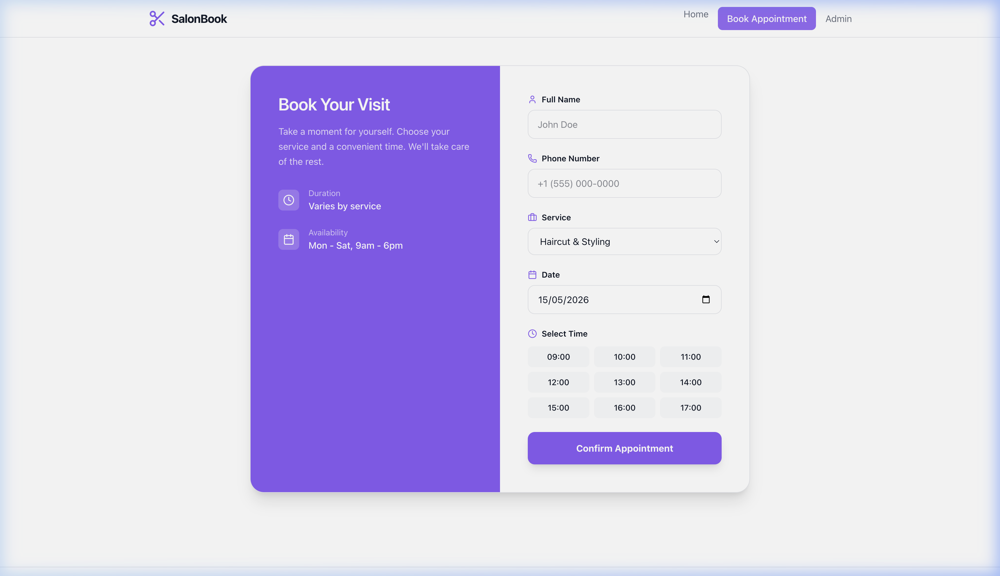

# SalonBook - Modern Salon Booking App




## Features
- **Modern UI**: Clean, responsive design with glassmorphism and smooth transitions.
- **Service Selection**: Browse available services with pricing and duration.
- **Real-time Booking**: Select dates and time slots with instant confirmation.
- **Double-Booking Prevention**: Built-in logic to prevent multiple bookings for the same slot.
- **Admin Dashboard**: Protected area for salon owners to view, manage, and confirm appointments.
- **Google Authentication**: Secure login for administrators.

## Tech Stack
- **Frontend**: React (Vite)
- **Backend/DB**: Firebase Firestore
- **Authentication**: Firebase Auth (Google Provider)
- **Styling**: Tailwind CSS 4
- **Icons**: Lucide React
- **Date Management**: date-fns

## Local Setup

1. **Clone the project** and navigate to the directory:
   ```bash
   cd SalonBook
   ```

2. **Install dependencies**:
   ```bash
   npm install
   ```

3. **Configure Firebase**:
   - Create a project on the [Firebase Console](https://console.firebase.google.com/).
   - Enable **Firestore Database** and **Authentication** (Google Login).
   - Create a `.env` file in the root and add your Firebase credentials:
     ```env
     VITE_FIREBASE_API_KEY=your_api_key
     VITE_FIREBASE_AUTH_DOMAIN=your_auth_domain
     VITE_FIREBASE_PROJECT_ID=your_project_id
     VITE_FIREBASE_STORAGE_BUCKET=your_storage_bucket
     VITE_FIREBASE_MESSAGING_SENDER_ID=your_sender_id
     VITE_FIREBASE_APP_ID=your_app_id
     ```

4. **Run the development server**:
   ```bash
   npm run dev
   ```

## Deployment

1. **Build the project**:
   ```bash
   npm run build
   ```

2. **Install Firebase CLI** (if not already):
   ```bash
   npm install -g firebase-tools
   ```

3. **Login to Firebase**:
   ```bash
   firebase login
   ```

4. **Initialize Firebase** (optional if using provided config):
   ```bash
   firebase init
   ```
   Select **Hosting** and **Firestore**. Use `dist` as your public directory and configure as a single-page app.

5. **Deploy**:
   ```bash
   firebase deploy
   ```

## Firestore Schema
**Collection: `appointments`**
- `customerName`: String
- `phone`: String
- `service`: String
- `bookingDate`: String (YYYY-MM-DD)
- `bookingTime`: String (HH:MM)
- `status`: String ('pending' | 'confirmed')
- `createdAt`: Timestamp
